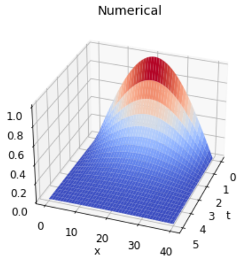

### TMA4212 Numerical solution of differential equations by difference methods
https://wiki.math.ntnu.no/tma4212/2023v/ovinger
# Various tasks and assignments
Difference schemes for different types of partial differential equations. Analysis of consistency, order, stability and convergence.
Solution of linear systems by iterative methods and preconditioning. Finite element method.    
The following is some samples from the projects (Descending order).  

###  Project 2: A 1d stationary convection diffusion problem
The goal of this project was to analyse the solution to a 1-dimensional stationary convection-
diffusion problem, which models a chemical in a fluid moving in a finite tube.

###  Project 1: Heat distribution in anisotropic materials & in irregular domains
The goal of this project was to look at numerical problems and different methods for solving
two-dimensional heat distribution in anisotropic and isotropic materials.

### Exercise 3: Crank-Nicholson method to solve the Black-Scholes PDE

### Exercise 2: Forward Euler Neumann

